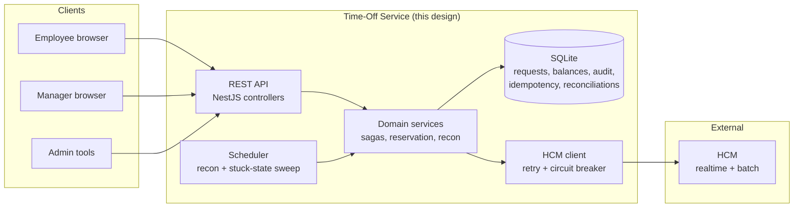
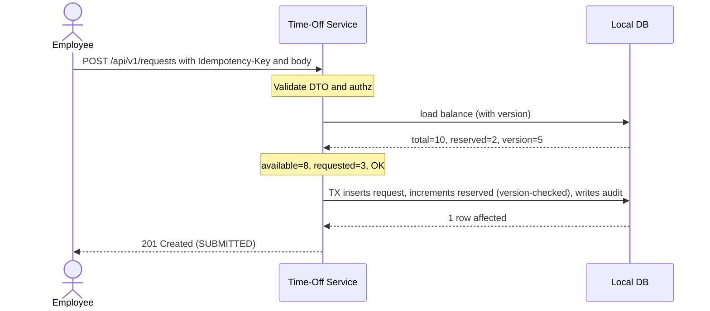
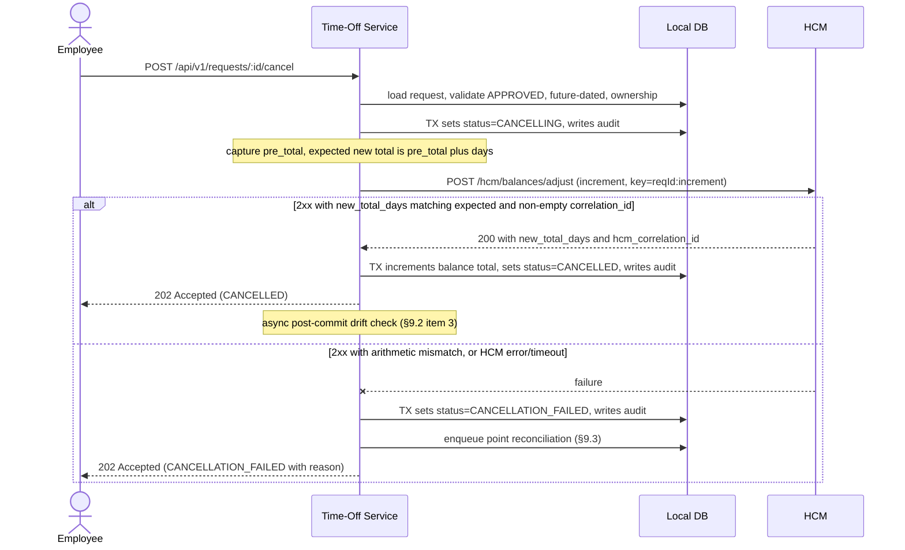
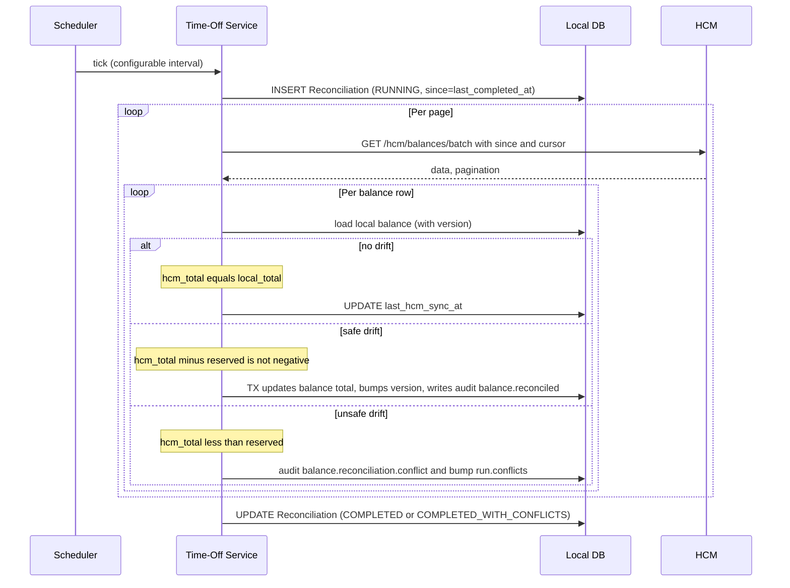
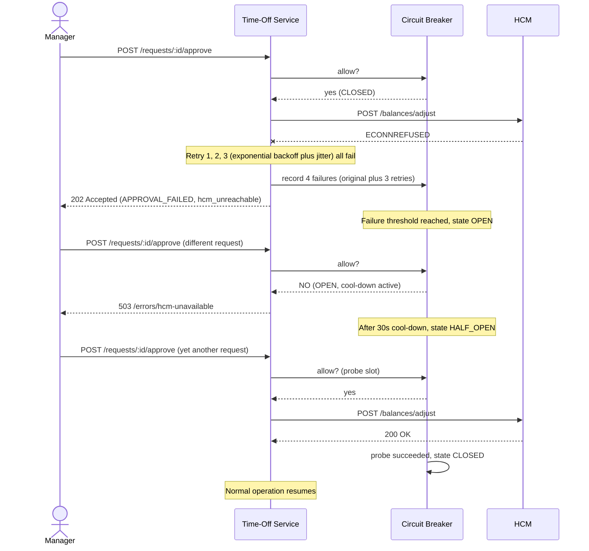
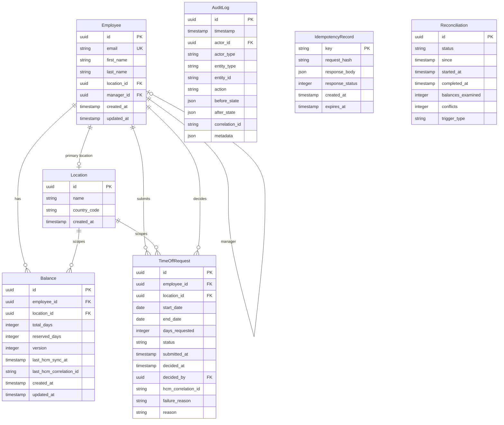
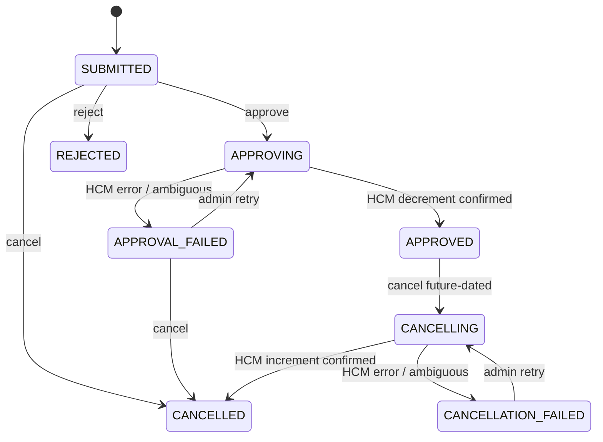
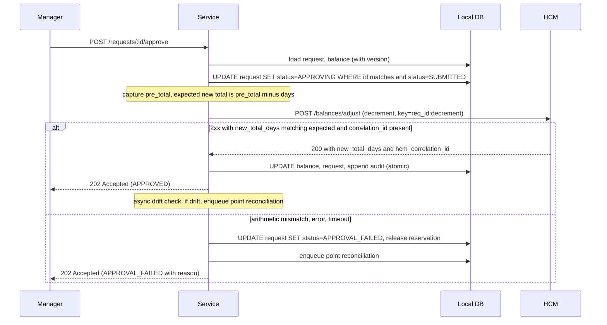
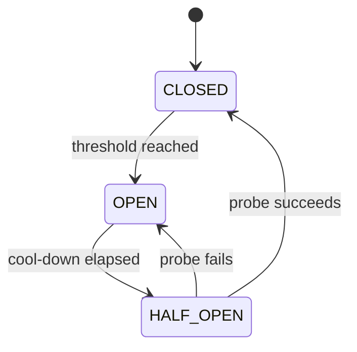

# Time-Off Service
## Technical Requirements Document

| Field | Value |
|---|---|
| **Author** | Muhammad Saeed (muhammadcaeed@gmail.com) |
| **Status** | Draft |
| **Last Updated** | 2026-05-24 |
| **Version** | 1.0 |

---

## How to read this document

This Technical Requirements Document specifies the **Time-Off Service**, a backend microservice that coordinates time-off requests between the ExampleHR product and an external HCM system. Three audiences are served: reviewers evaluating the design, engineers implementing it, and AI agents generating code against it.

### Technical Summary

The service models pending time off as local reservations and contacts HCM only at approval, when a saga wraps a single HCM write between two local transactions with explicit success and failure states. HCM is the source of truth for balances; the local cache absorbs external changes through scheduled batch reconciliation and a targeted point variant. Every HCM call is defended by a deterministic idempotency key, an expected-total arithmetic check on the response, asynchronous post-commit drift detection, and a hand-rolled circuit breaker wrapping a bounded retry loop. The test suite verifies five invariants under random operation sequences and covers every state transition, race scenario, and failure mode through a traceability matrix that fails CI on drift. Twelve ADRs document the alternatives weighed for each major decision.

### Reading paths

Three ways into the document, by intent and time budget.

| Path | What you read |
|---|---|
| **Evaluate judgment and problem framing** | [§1 Context, problem, eight challenges](#1-context-problem-statement-and-key-challenges) + [§2 Goals and success criteria](#2-goals-non-goals-and-success-criteria) + [ADR index](./trd/adr/README.md) |
| **Review the design end-to-end** | The skim above plus [§3 Flows](#3-personas-and-primary-flows), [§4 Domain model](#4-domain-model-and-key-invariants), [§5 State machine](#5-request-lifecycle-state-machine), [§9 HCM integration](#9-hcm-integration-and-sync-design), [§10 Concurrency](#10-concurrency-consistency-and-the-reservation-pattern), [§11 Failure handling](#11-failure-modes-recovery-and-defensive-behaviors) |
| **Implement against this spec** | Whole document plus the companion files in the map below |

### Document map

The TRD is the design narrative. Companion files carry implementer reference detail. ADRs document the alternatives evaluated for each major decision. Every TRD section is mapped to its companion (where one exists) and to the ADRs that govern its choices.

| TRD section | Companion (implementer detail) | Governing ADRs |
|---|---|---|
| [§1 Context and challenges](#1-context-problem-statement-and-key-challenges) | — | — |
| [§2 Goals, non-goals, success](#2-goals-non-goals-and-success-criteria) | — | — |
| [§3 Personas and flows](#3-personas-and-primary-flows) | — | — |
| [§4 Domain model and invariants](#4-domain-model-and-key-invariants) | [data-model.md](./trd/data-model.md) | [ADR-001](./trd/adr/001-reservation-pattern.md), [ADR-005](./trd/adr/005-optimistic-concurrency.md), [ADR-010](./trd/adr/010-fk-enforcement.md) |
| [§5 Request lifecycle state machine](#5-request-lifecycle-state-machine) | — | [ADR-002](./trd/adr/002-saga-pattern.md), [ADR-012](./trd/adr/012-cancellation-routing.md) |
| [§6 Functional requirements](#6-functional-requirements) | [requirements.md](./trd/requirements.md) | — |
| [§7 Non-functional requirements](#7-non-functional-requirements) | — | — |
| [§8 API contract](#8-api-contract) | [api-contract.md](./trd/api-contract.md) | [ADR-004](./trd/adr/004-rest-vs-graphql.md) |
| [§9 HCM integration and sync](#9-hcm-integration-and-sync-design) | [hcm-integration.md](./trd/hcm-integration.md), [mock-hcm.md](./trd/mock-hcm.md) | [ADR-006](./trd/adr/006-sync-strategy.md), [ADR-007](./trd/adr/007-idempotency.md), [ADR-011](./trd/adr/011-point-reconciliation-async-queue.md) |
| [§10 Concurrency and reservations](#10-concurrency-consistency-and-the-reservation-pattern) | [concurrency.md](./trd/concurrency.md) | [ADR-001](./trd/adr/001-reservation-pattern.md), [ADR-005](./trd/adr/005-optimistic-concurrency.md) |
| [§11 Failure handling](#11-failure-modes-recovery-and-defensive-behaviors) | [failure-handling.md](./trd/failure-handling.md) | [ADR-008](./trd/adr/008-resilience.md) |
| [§12 Test strategy](#12-test-strategy-and-traceability) | [test-strategy.md](./trd/test-strategy.md), [traceability.md](./trd/traceability.md) | — |
| [§13 Security](#13-security) | — | [ADR-003](./trd/adr/003-jwt-auth.md) |
| [§14 Operational concerns](#14-operational-concerns) | — | — |
| [§15 Technology stack](#15-technology-stack) | — | [ADR-009](./trd/adr/009-monorepo-layout.md) |

Full ADR index with statuses and cross-references: [adr/README.md](./trd/adr/README.md).

---

## 1. Context, problem statement, and key challenges

### 1.1 Domain context

The Time-Off Service is a backend microservice that coordinates time-off interactions in the ExampleHR product. It sits between the ExampleHR application and the organization's Human Capital Management (HCM) system. The HCM holds authoritative employment data including time-off balances. ExampleHR is the employee-facing surface. The Time-Off Service is the coordination layer that turns user-facing operations into safe, consistent HCM interactions.

The HCM exposes two integration channels. A realtime API reads and writes individual balance values for a given (employee, location) pair. A batch endpoint returns the entire corpus, paginated. The realtime API serves the hot path; the batch endpoint catches up on changes that originate elsewhere.

The service is one of several writers to the HCM. Other writers include HCM-internal processes (anniversary grants, year-end refresh), manual adjustments by HR personnel, and integrations from other workforce systems. The HCM doesn't push change notifications. The service discovers external changes through reconciliation.

The HCM is expected to reject invalid operations and return structured errors. That guarantee is best-effort. The HCM occasionally accepts operations that didn't take effect, or returns ambiguous responses. Defensive design is foundational.

### 1.2 User expectations

Three expectations shape the service:

**Employees** need accurate balance visibility and immediate, definitive feedback. Balance reads reflect both committed deductions and pending reservations.

**Managers** approve on the assumption that the data they see is valid. Approvals either succeed atomically or fail with an actionable explanation. Approving a request that later turns out to be over-balance isn't acceptable.

**Auditors and HR staff** require a complete, immutable history of every state change: what happened, when, who acted, and the state before and after.

### 1.3 Key challenges

Eight challenges flow from the two-system reality and the operational constraints of HCM integration. Each is addressed in detail in the section noted alongside.

1. **Two-system balance synchronization.** The HCM holds authoritative values; the service caches them and models in-flight reservations. The two stores can disagree. The design specifies which wins and how disagreements resolve. → Sections 9, 10.

2. **HCM updates from sources outside our control.** Anniversary grants, year-end refresh, manual HR edits, and other workforce systems modify HCM balances without notifying us. → Section 9.3.

3. **HCM exposes two channels with different semantics.** Realtime API for the hot path, batch endpoint for catch-up. Both must coexist coherently. → Section 9.1.

4. **HCM error responses are unreliable.** The HCM is expected to reject invalid operations, but occasionally accepts operations that didn't take effect or returns ambiguous responses. Local validation, the pre-write expected-total arithmetic check on the adjust response, asynchronous post-commit drift detection, and reconciliation each play a role. → Sections 9.2, 11.

5. **Concurrent writes must preserve balance invariants.** Employees, managers, and the reconciliation job can act on the same (employee, location) row simultaneously. Without explicit coordination, balances corrupt. → Section 10.

6. **Approval-time validation must hold across both systems.** A request can be valid locally but invalid against HCM, for example after a recent HCM-side adjustment. → Sections 5, 9.

7. **Cancellation requires compensation.** Cancelling an approved future-dated request reverses the HCM decrement. Saga in reverse, idempotent under retries. → Sections 5.2, 9.2.

8. **Reconciliation must resolve drift without violating in-flight reservations.** Batch endpoint disagreement requires reapplying pending reservations on top of the new authoritative total without loss or duplication. → Sections 9.3, 10.3.

### 1.4 System context

One frame, everything the service touches.



Reads and submissions stay inside the dashed box. Approval and cancellation sagas cross to HCM through the HCM client. The scheduler drives reconciliation and the stuck-state sweep (§11.4). The audit table sits inside the local DB and shares transactions with every state change.

---

## 2. Goals, non-goals, and success criteria

### 2.1 Goals

The service is designed to:

1. Provide balance visibility that reflects both committed deductions and in-flight reservations
2. Guarantee balance integrity under concurrent writes from employees, managers, and reconciliation
3. Coordinate state changes with the HCM as the authoritative source, including compensation on cancellation
4. Detect and resolve drift caused by HCM-side changes the service didn't initiate
5. Operate defensively against unreliable HCM responses (timeouts, ambiguous success, false errors)
6. Maintain a complete, immutable audit of every state change

### 2.2 Non-goals

The following are explicitly out of scope. Each is a deferred concern with a clear path to address later.

- **Multiple leave types.** Per-employee per-location balances demonstrate the synchronization and reservation patterns. Multi-type accrual is a schema extension.
- **Business day calculation.** Calendar days are the unit of computation. Holiday and weekend handling is a policy layer above the balance engine.
- **HCM webhook ingestion.** Batch reconciliation handles HCM-initiated changes. Webhooks would optimize latency without changing correctness.
- **Email or Slack notifications.** Side-effect routing is a downstream concern, not architectural.
- **Time zone handling.** UTC is assumed. Per-tenant or per-employee TZ doesn't affect the synchronization model.
- **Soft deletes and retention policies.** The audit log retains history; soft deletes add complexity without addressing a current need.
- **Frontend or UI.** The service is backend-only.
- **Production deployment and IaC.** Out of scope at the design layer.
- **Multi-tenancy.** Single-organization deployment is assumed.
- **OIDC / IdP integration.** JWT validation demonstrates the auth contract. Identity federation is a deployment concern.
- **Analytics and reporting.** The audit log is the data source. Report generation is a downstream concern.

### 2.3 Success criteria

The design and implementation are successful when:

1. Balance invariants (INV-01 through INV-05, defined in Section 4) hold under all concurrency patterns exercised by the test suite
2. All HCM-bound operations are idempotent: replay produces no additional effect
3. Approval transitions either commit atomically (request APPROVED, HCM confirmed, balance updated) or roll back fully (reservation released, no partial state)
4. Reconciliation against HCM drift converges to consistency within one cycle, without losing or duplicating in-flight reservations
5. The service remains read-available when the HCM is unreachable; the write path fails fast with an actionable error
6. Every state transition produces an audit entry with actor, timestamp, and before/after state

---

## 3. Personas and primary flows

### 3.1 Personas

**Employee.** The end user of the ExampleHR product. Reads their own balance, submits requests for time off, cancels their own requests. Interacts with the service through the ExampleHR application layer.

**Manager.** An Employee who also has direct reports (employees where `manager_id` matches the manager's id). Reads balances and requests of their direct reports. Approves or rejects pending requests.

**Admin.** An operations or HR systems role. Reads balances and requests across all employees. Triggers reconciliation runs and retries failed saga states (APPROVAL_FAILED, CANCELLATION_FAILED). Doesn't approve or reject in the normal flow.

**HCM (Human Capital Management).** External system, source of truth for employment data and time-off balances. Exposes the three endpoints in `hcm-integration.md` §1. Updates come from multiple writers: this service, internal HCM processes (anniversary grants, year-end refresh), HR personnel acting in the HCM's own interface, and other consumer applications.

### 3.2 Primary flows

#### Flow A: Submission (T-01)

No HCM interaction. The reservation is local-only and is enforced by the optimistic version check on the Balance row.



If the version-checked UPDATE returns 0 rows (concurrent writer changed the row), the service retries up to 3 times before returning 409.

#### Flow B: Approval saga (T-02, T-03, T-04)

The central case in the design. Forward saga: local transition to APPROVING, HCM decrement call with idempotency key, expected-total check on the response, local commit either to APPROVED (success) or APPROVAL_FAILED (any failure path, including ambiguous responses). Full sequence diagram in §9.1.

The retry path (T-05) is an Admin calling `POST /requests/:id/approval-retries`. It re-validates available balance, re-acquires the reservation, calls HCM with the original idempotency key, and HCM returns the prior outcome (ADR-007).

#### Flow C: Cancellation of an approved future-dated request (T-09, T-10, T-11)

Reverse saga. Same shape as Flow B with `operation_type: INCREMENT` and idempotency key `<req_id>:increment`. Admin can also invoke the cancel endpoint on behalf of an employee.



### 3.3 Secondary flows

#### Flow D: Scheduled reconciliation

Runs on a configurable schedule plus on-demand via `POST /reconciliations`. Each run is a tracked resource. Conflict resolution follows §9.3.



#### Flow E: HCM unreachable and circuit breaker engagement

Reads continue from cache; writes fast-fail with 503 once the breaker opens. Read availability is preserved through a complete HCM outage; write availability is sacrificed deliberately.



While the breaker is OPEN, balance reads still serve from cache and the scheduled reconciliation skips its run rather than retry blindly.

---

## 4. Domain model and key invariants

### 4.1 Entity-relationship diagram



The arrow looping from Employee back to Employee labeled "manager" represents the self-referential FK: an employee's `manager_id` is the id of another Employee row.

Seven entities anchor the domain. **Employee** and **Location** are HCM-sourced reference data. **Balance** carries the two-counter reservation model (`total_days` and `reserved_days`; ADR-001) plus the OCC `version` column (ADR-005). **TimeOffRequest** is the lifecycle entity that drives the sagas in §5. **AuditLog** is append-only and shares transaction boundaries with every state change. **IdempotencyRecord** stores client-facing idempotency for the `Idempotency-Key` header (semantics in `api-contract.md` §6). **Reconciliation** tracks each batch or point run as a first-class resource so re-runs are idempotent and operationally visible.

Field-level specifications, indexes, constraints, and per-entity notes are in [`data-model.md`](./trd/data-model.md).

### 4.2 Key invariants

The test suite verifies these under all exercised concurrency patterns and failure scenarios.

- **INV-01**: `Balance.reserved_days >= 0` at all times.
- **INV-02**: `Balance.total_days - Balance.reserved_days >= 0` at all times. The service never reserves more than is available.
- **INV-03**: For every `(employee_id, location_id)`, `Balance.reserved_days` equals the sum of `days_requested` across all TimeOffRequest rows with status in `(SUBMITTED, APPROVING, CANCELLING)` for that pair. The denormalized counter is always in sync with the source-of-truth requests.
- **INV-04**: Every TimeOffRequest that has crossed an HCM boundary (status currently or previously `APPROVED`, or status `CANCELLED` reached via T-10) has a non-null `hcm_correlation_id` recorded against the most recent HCM operation. Decrement and increment both populate the field; the audit log preserves prior correlation ids when a subsequent operation overwrites the column.
- **INV-05**: AuditLog is append-only. No row is updated or deleted.

INV-03 is the strongest. It connects the denormalized counter to the underlying request rows and gives the test suite a single-query consistency check: compare `(employee_id, location_id, reserved_days)` from Balance against `SUM(days_requested) GROUP BY (employee_id, location_id)` from TimeOffRequest filtered to SUBMITTED, APPROVING, and CANCELLING. Disagreement is a bug.

Linked ADRs: ADR-001 (reservation pattern), ADR-005 (optimistic concurrency).

---

## 5. Request lifecycle state machine

The state machine has eight states and twelve transitions. It captures two sagas: the forward saga (approval, which triggers an HCM decrement) and the reverse saga (cancellation of an approved future-dated request, which triggers an HCM increment). Both sagas use intermediate and failure states so the in-flight and failed cases are addressable, retryable, and verifiable in tests.

### 5.1 State diagram



**Terminal states**: `REJECTED`, `CANCELLED`. `APPROVED` is effectively terminal once `start_date <= today`; before then it can transition to `CANCELLING`.

**Sticky states**: `APPROVAL_FAILED` and `CANCELLATION_FAILED` exit only via retry succeeding. Persistent failures here surface as reconciliation alerts; long-term remediation is admin-driven (see §15).

### 5.2 Transition reference

| ID | From → To | Trigger | Actor | Balance side effects | HCM interaction | Audit signal |
|---|---|---|---|---|---|---|
| T-01 | `[*] → SUBMITTED` | `POST /requests` | Employee | `reserved_days += days` | none | `request.submitted` |
| T-02 | `SUBMITTED → APPROVING` | `POST /requests/:id/approve` | Manager | none (reservation persists) | decrement initiated, key `<id>:decrement` | `request.approving` |
| T-03 | `APPROVING → APPROVED` | HCM decrement returns 2xx with `new_total_days == pre_total - days` and correlation_id | SYSTEM | `total_days -= days`, `reserved_days -= days` | confirmed | `request.approved`, `hcm.decrement.confirmed` |
| T-04 | `APPROVING → APPROVAL_FAILED` | HCM error, timeout, or ambiguous response | SYSTEM | `reserved_days -= days` (reservation released) | retry available via T-05 | `request.approval_failed`, `hcm.decrement.failed` |
| T-05 | `APPROVAL_FAILED → APPROVING` | `POST /requests/:id/approval-retries` | Admin | `reserved_days += days` (re-acquired) | decrement re-initiated, same idempotency key | `request.approving` (retry) |
| T-06 | `APPROVAL_FAILED → CANCELLED` | `POST /requests/:id/cancel` | Employee or Admin | none (already released by T-04) | none | `request.cancelled` |
| T-07 | `SUBMITTED → REJECTED` | `POST /requests/:id/reject` | Manager | `reserved_days -= days` | none | `request.rejected` |
| T-08 | `SUBMITTED → CANCELLED` | `POST /requests/:id/cancel` | Employee | `reserved_days -= days` | none | `request.cancelled` |
| T-09 | `APPROVED → CANCELLING` | `POST /requests/:id/cancel` (gated on `start_date > today`) | Employee | none | increment initiated, key `<id>:increment` | `request.cancelling` |
| T-10 | `CANCELLING → CANCELLED` | HCM increment confirmed | SYSTEM | `total_days += days` | confirmed | `request.cancelled`, `hcm.increment.confirmed` |
| T-11 | `CANCELLING → CANCELLATION_FAILED` | HCM error, timeout, or ambiguous response | SYSTEM | none | retry available via T-12 | `request.cancellation_failed`, `hcm.increment.failed` |
| T-12 | `CANCELLATION_FAILED → CANCELLING` | `POST /requests/:id/cancellation-retries` | Admin | none | increment re-initiated, same idempotency key | `request.cancelling` (retry) |

Authorization predicates for each Actor column are enforced by RBAC guards described in §13.

### 5.3 Notes on selected transitions

- **T-04 and T-11 (failure states)** are reached when the HCM operation errors, times out, or returns an ambiguous response (2xx with `new_total_days != pre_total + delta`, or any of the conditions in F-04). Reservation handling differs by direction: T-04 releases the reservation because the decrement never confirmed; T-11 holds nothing because cancellation doesn't reserve.
- **T-05 and T-12 (retry paths)** re-use the same idempotency key as the original attempt (`<id>:decrement` or `<id>:increment`) and re-validate available balance against the current state before re-acquiring the reservation (REQ-LIFE-06, REQ-LIFE-12). The HCM is expected to no-op a duplicate request that already took effect. See §9.2 and ADR-007.
- **T-06 (APPROVAL_FAILED → CANCELLED)** is semantically a *discard* rather than a true cancellation: the reservation was already released by T-04 and no HCM call is needed. It exists to give the request a clean terminal state once the owner or an admin acknowledges the failed approval. The audit signal is `request.discarded`.
- **T-09 (cancel approved)** is gated on `start_date > today`. Past-dated approved leave can't be cancelled through this path; it would require an admin correction outside the normal flow.
- **Concurrency on transitions.** Every status change uses a status-predicate CAS (`WHERE id = :id AND status = :expected_status`); a zero-row result returns 409 `/errors/invalid-state-transition`. The `Balance` row is independently protected by its `version` column. See §10.2 for both patterns and §10.3 for race scenarios.

Linked ADR: ADR-002 (saga over 2PC).

---

## 6. Functional requirements

Functional requirements live in [`requirements.md`](./trd/requirements.md) §1 in EARS notation (Easy Approach to Requirements Syntax). Each requirement carries a stable ID for traceability, an EARS pattern label, and one testable behavior. The mapping from REQ-* to test cases lives in [`traceability.md`](./trd/traceability.md) and is verified in CI.

Categories:

| Category | IDs | Coverage focus |
|---|---|---|
| Balance read | REQ-BAL-01..05 | Authorization, cache freshness, available-days computation |
| Lifecycle | REQ-LIFE-01..16 | All 12 state transitions, retry paths, guard rails |
| HCM sync | REQ-SYNC-01..08 | Idempotency, arithmetic check, drift detection, circuit breaker |
| Reconciliation | REQ-REC-01..06 | Algorithm, conflict resolution, run-as-resource |
| Defensive | REQ-DEF-01..12 | Invariants, idempotency, audit, OCC, stuck-state sweep |

EARS patterns used: Ubiquitous (`The system shall ...`), Event-driven (`When ... the system shall ...`), State-driven (`While ... the system shall ...`), Unwanted-behavior (`If ... then the system shall ...`).

## 7. Non-functional requirements

Non-functional requirements live in [`requirements.md`](./trd/requirements.md) §2. They cover performance, availability, durability, and scalability targets that don't fit cleanly into EARS notation.

Summary:

- **Performance.** Latency targets per operation at p50/p95/p99. Balance read (cached) p95 < 50ms; submission p95 < 100ms; approval (HCM round-trip) p95 < 500ms.
- **Availability.** Read path remains available whenever the service and local DB are reachable. Write path fast-fails when the HCM circuit breaker is OPEN. Reconciliation skips during HCM outage.
- **Durability.** Audit log retained indefinitely. Local state recoverable via audit replay. Total DB loss recoverable via HCM batch + audit. Migrations explicit, never `synchronize: true`.
- **Scalability.** Single-instance assumed. Horizontal scaling supported on Postgres migration. All thresholds env-driven.

See `requirements.md` §2 for measurable targets and test references.

## 8. API contract

The full API contract lives in [`api-contract.md`](./trd/api-contract.md): endpoint reference, RBAC matrix, RFC 7807 error envelope, pagination, idempotency semantics, async polling, rate limiting.

Summary:

- **Style.** REST under `/api/v1`. State transitions modeled as action sub-resources (`/requests/:id/approve`, `/approval-retries`). See [ADR-004](./trd/adr/004-rest-vs-graphql.md).
- **Auth.** `Authorization: Bearer <jwt>` carrying `sub` and `roles`. Three roles: EMPLOYEE, MANAGER, ADMIN. Resource-level checks load the target before evaluating; 403 hides existence. See [ADR-003](./trd/adr/003-jwt-auth.md).
- **Status codes.** 202 Accepted for async sagas (approve, retries, post-approval cancel, reconcile). 200 OK for sync terminal operations (reject, pre-approval cancel). 409 Conflict for state mismatch. 503 `/errors/hcm-unavailable` when the circuit breaker is OPEN.
- **Idempotency.** `Idempotency-Key: <UUID v4>` required on all POST endpoints. 24-hour retention. Same key + same body → replay; same key + different body → 422.
- **Errors.** RFC 7807 Problem Details with domain-specific `type` URIs (`/errors/insufficient-balance`, `/errors/invalid-state-transition`, `/errors/idempotency-conflict`, etc.).
- **Pagination.** Cursor-based, opaque cursor. Default limit 50, max 100. Stable under concurrent writes.
- **Async polling.** 202 responses return the request in an intermediate state (APPROVING/CANCELLING). Clients poll `GET /requests/:id` with backoff (200ms → 2s, 30s total) until a terminal state.

## 9. HCM integration and sync design

The HCM integration is the heart of the service. It has to be fast on the hot path, defensive against unreliable HCM responses, and consistent when the HCM changes outside the service's view.

The model is hybrid. The realtime API drives the write hot path. The batch endpoint feeds scheduled reconciliation. Reads serve from the local cache. Defensive wrappers (idempotency, expected-total check, async drift detection, audit, circuit breaking) sit on every HCM call.

Full HCM contract shapes, reconciliation pseudocode, point-reconciliation pseudocode, multi-writer detail, and the expected-total rationale live in [`hcm-integration.md`](./trd/hcm-integration.md). Mock HCM details are in [`mock-hcm.md`](./trd/mock-hcm.md).

### 9.1 Hybrid sync model

**Read path.** Balance reads serve from the local Balance row with no HCM call. Available days is `total_days - reserved_days`. Reads can be stale by up to one reconciliation interval; the staleness reflects HCM-side changes the user wasn't aware of anyway.

**Submission path.** Local validation only. The service confirms `available_days >= days_requested`, inserts a SUBMITTED request, and increments `reserved_days` under optimistic version check (ADR-005). No HCM call. Deferring HCM contact until approval keeps user-facing latency low and avoids HCM load for requests that never reach a manager (ADR-001).

**Approval saga.**



Cancellation mirrors this in reverse with `operation_type: "INCREMENT"` and idempotency key `req_id:increment`.

**Reconciliation path.** Scheduled (configurable; 15 min in development, 60 min in production) plus on-demand via `POST /reconciliations`. Pulls the batch endpoint with `since=<last_successful_run_at>` and applies the conflict rules in §9.3.

The service is one of several writers to HCM (HCM-internal anniversary grants and refresh, HR manual edits, other consumer apps). Reconciliation is the only discovery channel since HCM doesn't push notifications. Full multi-writer rationale in `hcm-integration.md` §5.

### 9.2 Defensive behaviors

Seven defenses wrap every HCM interaction. The service treats HCM responses as untrustworthy by design.

1. **Idempotent writes.** Every adjust call carries `<request_id>:<operation_type>` as the idempotency key (ADR-007).
2. **Expected-total arithmetic check.** Commit only on 2xx + non-empty `hcm_correlation_id` + `new_total_days == pre_total + delta`. Mismatch routes to APPROVAL_FAILED with point reconciliation enqueued. Full rationale (why this replaced a synchronous verification GET) in `hcm-integration.md` §4.
3. **Async post-commit drift check.** Non-blocking GET after commit; disagreement emits `hcm.<op>.drift_detected` and enqueues point reconciliation.
4. **Audit on every call.** Successes, failures, drift, and ambiguous outcomes log identically.
5. **Ambiguous treated as failure.** Mismatch on 2xx, connection drop, timeout, or 5xx-after-partial-send all route to the failure path.
6. **Circuit breaker.** State machine wraps the HCM client (§11.2, ADR-008).
7. **Retry with backoff and jitter.** Retryable errors only (5xx, network, timeout); 4xx propagates; retries reuse the original idempotency key (§11.3, ADR-008).

### 9.3 Reconciliation rules

Each reconciliation run is a tracked resource. The algorithm preserves in-flight reservations and refuses to violate invariants when HCM disagrees. Full pseudocode in `hcm-integration.md` §2.

Conflict resolution:

- **HCM wins for `total_days`.** The HCM is authoritative; the service updates to match.
- **Local wins for `reserved_days`.** Reservations reflect commitments the HCM never sees.
- **`hcm_total_days < reserved`: critical conflict.** Refuse the update (would violate INV-02). Mark the run `COMPLETED_WITH_CONFLICTS`, emit alert, admin remediation.

The algorithm is idempotent and resumable; re-running with the same `since` produces the same outcome.

**Point reconciliation** is the targeted variant: a single `(employee, location)` refresh triggered by F-05 (HCM rejected what local validation passed) or by the async drift signal in §9.2 item 3. Cheap (one realtime read, one local TX); the affected case unblocks in seconds instead of waiting for the next batch cycle. Same conflict rules. Pseudocode in `hcm-integration.md` §3.

Linked ADRs: ADR-006 (sync strategy), ADR-007 (idempotency), ADR-008 (resilience).

---

## 10. Concurrency, consistency, and the reservation pattern

The service preserves balance integrity under concurrent writes from employees, managers, and the reconciliation job. This section specifies the patterns.

### 10.1 The reservation pattern

Balance state carries two counters:

- `total_days`: HCM-sourced authoritative total. Updated when HCM confirms a change or reconciliation observes drift.
- `reserved_days`: local sum of `days_requested` across all TimeOffRequests in (SUBMITTED, APPROVING, CANCELLING) for the same (employee, location).

Available balance is `total_days - reserved_days`.

The pattern earns its place by making three problems easy:

- **Concurrent submissions don't corrupt.** Each submission increments `reserved_days` under an optimistic version check; one wins, the loser retries.
- **HCM rejection costs nothing.** Submission doesn't touch `total_days`. A rejected request releases the reservation with no HCM compensation call.
- **Reconciliation is non-disruptive.** A new HCM total updates `total_days` without touching `reserved_days`. In-flight requests preserved automatically.

Alternatives (immediate decrement, computed reservations, pessimistic locking) are evaluated in ADR-001.

### 10.2 Optimistic concurrency control

Every `Balance` row carries a `version` column. Every UPDATE carries `WHERE id = :id AND version = :observed_version`. Zero-row result means a concurrent writer changed the row; caller re-reads and retries up to 3 times before returning 409 Conflict.

`TimeOffRequest` rows use the same pattern with a status-predicate CAS (`WHERE id = :id AND status = :expected_status`); zero-row result there maps to `/errors/invalid-state-transition` (409) without retry, because the safe interpretation is that someone else already acted.

The pattern is portable. SQLite serializes writers at the database level (one writer at a time in WAL mode); Postgres allows true row-level concurrency; the CAS works identically on both. Protocol detail and the SQLite-vs-Postgres test-realism note are in [`concurrency.md`](./trd/concurrency.md). ADR-005.

### 10.3 Race scenarios and mitigations

| ID | Scenario | Invariant at risk | Mitigation |
|---|---|---|---|
| **R-01** | Two concurrent submissions, individually valid, together exceed balance. Example: employee has 5 days available, two tabs each submit a 3-day request simultaneously. | INV-02 (`total − reserved ≥ 0`) | Version check on the Balance row. One submission wins the CAS; the other re-reads and now sees `available = 2 < 3`, returns 409 with `/errors/insufficient-balance`. |
| **R-02** | Submission concurrent with reconciliation. Reconciliation updates `total_days` to a lower value while the submission is in flight. | INV-02 | Version mismatch on the submission's write. Retry re-reads the new lower total. Submission either succeeds at the new available level or fails with insufficient balance. |
| **R-03** | Approval times out. Service marks APPROVAL_FAILED. Admin retries. The original HCM decrement eventually succeeded. | INV-03 and double-decrement risk | Idempotency key `<request_id>:decrement` is identical across original and retry. HCM returns the original success response. The arithmetic check on the retry response confirms (`new_total_days == pre_total - days`, computed against the local total at retry time after point reconciliation has refreshed it). Service commits once. |
| **R-04** | HCM decrement succeeds, local transaction (balance update + request update) fails. | Consistency between HCM and local | In-process retry of the local transaction with the verified HCM state. If retries exhaust, the request stays in APPROVING. The stuck-state sweep (§11.4) detects it once `STUCK_STATE_THRESHOLD_MS` elapses, calls HCM with the original idempotency key, and either commits the saga locally (if HCM confirms) or transitions to APPROVAL_FAILED (if HCM has no record). |
| **R-05** | Cancellation arrives while the approval saga is in flight. Request is in APPROVING. | State machine integrity | Cancellation returns 409 when the request is in APPROVING or CANCELLING. The state has to first reach a cancellable terminal or sticky state (SUBMITTED, APPROVED, APPROVAL_FAILED, CANCELLATION_FAILED). |
| **R-06** | Reconciliation finds an HCM total that can't support local reservations. | INV-02 | Reconciliation refuses to update the balance. Run marked `COMPLETED_WITH_CONFLICTS`. Alert raised. Admin remediation. Detail in §9.3. |

Each scenario maps to a test case in [`traceability.md`](./trd/traceability.md) §7. The concurrency test layer (see [`test-strategy.md`](./trd/test-strategy.md) §1) exercises R-01, R-02, R-04, and R-05 with real parallelism.

### 10.4 Transaction boundaries

Local transactions are tight. Each state change is one DB transaction containing the entity update, the related balance update (if any), and the audit log entry. Status-predicate CAS on TimeOffRequest, version-check CAS on Balance, zero-row results trigger the appropriate response per §10.2. Full per-operation transaction-boundary table in [`concurrency.md`](./trd/concurrency.md) §5.

What is **not** in a single transaction is the cross-system part of the saga. The HCM call sits between two local transactions:

```
T_local_1:  transition request to APPROVING (or CANCELLING), commit
HCM call:   decrement (or increment) with arithmetic check on response (§9.2 item 2)
T_local_2:  commit success (APPROVED, CANCELLED) or failure (APPROVAL_FAILED, CANCELLATION_FAILED)
```

There's no 2PC because HCM is third party. The saga is the alternative: each step is reversible or idempotent, and a missing or failed step is detectable from the request's current status (ADR-002).

The audit log is always written in the same transaction as the state change it describes. INV-05 holds in practice because a state change without its audit row is impossible: they share the commit boundary.

Linked ADRs: ADR-001 (reservation), ADR-002 (saga over 2PC), ADR-005 (OCC).

---

## 11. Failure modes, recovery, and defensive behaviors

The service handles a defined set of failure modes explicitly. Each has a detection mechanism, a response, a recovery path, and an audit signal. Transient infrastructure issues outside this catalog (gateway 502s, DNS hiccups) collapse into one of the listed categories. The retry policy (§11.3) and circuit breaker (§11.2) wrap every HCM interaction.

### 11.1 Failure mode catalog

| ID | Failure | Detection | Response | Recovery | Audit signal |
|---|---|---|---|---|---|
| **F-01** | HCM unreachable (network failure) | HTTP client error: ECONNREFUSED, DNS failure, network unreachable | Retryable. Retry per §11.3. If exhausted or circuit OPEN, fail the operation. | Request → APPROVAL_FAILED / CANCELLATION_FAILED with reason `hcm_unreachable`. Admin retry once HCM is back. | `hcm.<op>.network_failure` |
| **F-02** | HCM timeout | Configured client timeout exceeded (5s realtime, 30s batch) | Treat as ambiguous. HCM may have processed. Retry with same idempotency key to determine outcome. | Same as F-01. Idempotency makes retry safe. | `hcm.<op>.timeout` |
| **F-03** | HCM 5xx | Response status in 500 to 599 | Retryable. Retry per §11.3. After max retries, fail the operation. | Same as F-01. | `hcm.<op>.server_error` with status code |
| **F-04** | Ambiguous response | One of: (a) HCM returns 2xx but `new_total_days != pre_total + delta`; (b) connection drops after request send but before response; (c) timeout after the request was sent; (d) 5xx with evidence of partial transmission. In each case the service can't conclude whether the operation took effect locally-consistently. | Treat as failure. Do not advance the request to APPROVED / CANCELLED. | Request → APPROVAL_FAILED / CANCELLATION_FAILED with reason `hcm_ambiguous`. Enqueue point reconciliation (§9.3) to refresh local total. Admin retry uses the same idempotency key; HCM returns the prior result. Once point reconciliation lands, retry can proceed against the refreshed balance. | `hcm.<op>.ambiguous` with metadata `(pre_total, delta, expected, actual)` |
| **F-05** | HCM 4xx insufficient balance | Response 409 from HCM after local validation passed (drift caused by an HCM-side change) | Not retryable. Fail immediately. | Request → APPROVAL_FAILED with reason `hcm_insufficient_balance`. Trigger point reconciliation. Employee resubmits against corrected balance. | `hcm.<op>.insufficient_balance` with local total and HCM response metadata |
| **F-06** | Local DB constraint violation mid-saga | SQL error during a saga's local transactions (version mismatch, unique violation, FK violation) | Depends on saga phase. Pre-HCM call: abort the saga cleanly. Post-HCM call (T-03 or T-10 commit fails): retry the transaction with re-read; if exhausted, leave the request in APPROVING / CANCELLING for the sweep. See R-04. | Admin retry verifies HCM via the original idempotency key and commits or marks failed. Reconciliation is the eventual safety net. | `db.constraint_violation` with metadata |
| **F-07** | Process crash mid-saga | After restart, requests are observed in APPROVING or CANCELLING with no progress beyond the stuck-state threshold | The stuck-state sweep (§11.4) detects the row, calls HCM with the original idempotency key, and commits or fails the saga locally based on the response. | Sweep resolves automatically within one cycle (default 60s) once the threshold (default 5 min) is exceeded. Reconciliation also catches related balance drift on its own schedule. | `lifecycle.recovery.committed` or `lifecycle.recovery.failed` |
| **F-08** | Reconciliation finds significant drift | Reconciliation algorithm detects `hcm_total != local_total` | If `hcm_total - reserved >= 0`: update local total. If not: refuse to update, raise conflict alert. | Auto-resolved when safe. Manual admin intervention when not. Detail in §9.3. | `balance.reconciled` or `balance.reconciliation.conflict` |

Cross-references:
- F-01, F-02, F-03 are wrapped by retry (§11.3) and the breaker (§11.2).
- F-04 is the most consequential defensive case; the arithmetic check (§9.2 item 2) catches it; point reconciliation (§9.3) closes the loop.
- F-05 is the only HCM error not retried; it triggers point reconciliation.
- F-07 is what the stuck-state sweep (§11.4) exists for.

### 11.2 Circuit breaker

The HCM client wraps every outbound call in a circuit breaker. When HCM is clearly failing, the service stops sending requests for a cool-down window, then probes.



- **CLOSED**: rolling window of 10 calls; opens on 5 consecutive failures or 50% failure rate.
- **OPEN**: HCM calls fast-fail with `/errors/hcm-unavailable` (503); 30s cool-down.
- **HALF_OPEN**: next call goes through as a probe; success closes, failure reopens.

Breaker accounts for F-01, F-02, F-03, F-04 as failures (F-04 because ambiguous responses indicate HCM misbehavior even when HTTP succeeded). F-05 is a domain error and doesn't count. Hand-rolled rather than `opossum` (ADR-008). Configuration parameters, per-operation behavior during OPEN, and the retry-storm-at-edge interaction are in [`failure-handling.md`](./trd/failure-handling.md).

### 11.3 Retry policy

Retries apply to F-01, F-02, F-03 only:

- **Max 3 retries** (4 calls total with the original).
- **Exponential backoff with full jitter**: 100ms, 200ms, 400ms, capped 5s.
- **Same idempotency key** on every retry (ADR-007).
- **F-04, F-05, F-06 not retried.**

Composition is **retry-inside-breaker**: the breaker decides whether the call is allowed; only allowed calls retry. Retry failures count toward the breaker's window so it reacts to actual load, not just distinct callers. ADR-008.

### 11.4 Stuck-state sweep

`APPROVING` and `CANCELLING` exit only on the next local transaction. Process crash mid-saga (F-07), or an HCM call hanging past the client timeout, leaves requests stuck. The sweep is the in-scope safety net.

A scheduled job (every 60s by default) scans for stuck rows older than 5 minutes, calls HCM with the original idempotency key, and either commits the saga locally on success or transitions to `*_FAILED` on definitive failure. Breaker-OPEN skips the cycle. Detailed step sequence and configuration in [`failure-handling.md`](./trd/failure-handling.md) §5.

The sweep brings F-07 out of the future-work bucket and into the test surface. It's distinct from scheduled reconciliation: reconciliation refreshes balance totals; the sweep resolves request-level state.

Linked requirements: REQ-DEF-07, REQ-LIFE-04, REQ-LIFE-10. Linked ADR: ADR-008.

---

## 12. Test strategy and traceability

The full test strategy lives in [`test-strategy.md`](./trd/test-strategy.md); the requirement-to-test matrix lives in [`traceability.md`](./trd/traceability.md). Both are verified in CI: missing or stale mappings fail the build.

Summary:

**Seven test layers**, executed in this order in CI (fast first):

| Layer | Purpose | Tooling |
|---|---|---|
| Unit | Pure logic in isolation | Vitest, in-process |
| Integration | Service + DB, no external HTTP | Vitest, `@nestjs/testing`, real SQLite |
| Contract | HCM client honors the assumed contract | Vitest, in-process mock HCM module |
| End-to-end | Full HTTP through the service | Vitest + supertest, out-of-process mock HCM |
| Concurrency | Real parallelism against running service | Vitest with `Promise.all` concurrent calls |
| Chaos | Failure injection (F-01 through F-08, breaker transitions) | Vitest, out-of-process mock HCM with scenario control plane |
| Property-based | Invariants under random operation sequences | Vitest + fast-check |

**Coverage approach.** 85% line coverage overall, 100% on critical services (reservation, sagas, reconciliation, circuit breaker). Scenario coverage is the lead indicator: every T-* transition, R-* race scenario, F-* failure mode, INV-* invariant, and REQ-* requirement is covered by at least one test.

**Traceability mechanism.** Each `describe` block carries `@req REQ-...` JSDoc annotations. A CI verifier matches annotations against `traceability.md`. Drift fails the build.

**Property-based testing for invariants.** fast-check generates random operation sequences (submit, approve, reject, cancel, retry, reconcile, plus HCM-side perturbations) and verifies INV-01 through INV-05 hold after every sequence. 1000 runs in CI, 200 locally. Failing seeds are committed as fixed unit tests.

**Mock HCM.** Used in two modes (in-process and out-of-process). Full spec in [`mock-hcm.md`](./trd/mock-hcm.md). Scenarios: `normal`, `slow`, `flaky`, `ambiguous-success`, `down`, `unverifiable-success`, `network-failure`, `idempotency-replay`, `idempotency-soft`.

## 13. Security

The brief doesn't require an auth design, so this section is scoped to what the service needs to demonstrate a credible production contract: input handling, secrets, audit, PII, and a minimal auth/RBAC stub.

### 13.1 Authentication and authorization (stub)

A JWT-bearer stub demonstrates the principal/role contract. Tokens carry `sub` (employee_id), `roles` (array of EMPLOYEE, MANAGER, ADMIN), `iat`, and `exp`. A global NestJS guard verifies signature and expiry; the verified principal flows into controller-level RBAC guards. HS256 for the stub; RS256 with JWKS is the OIDC migration target. 15-minute token lifetime; refresh sits upstream.

RBAC matrix:

| Role | Read own balance | Read others' | Submit own | Cancel own | Approve | Reject | Retry saga | Reconcile |
|---|---|---|---|---|---|---|---|---|
| EMPLOYEE | yes | no | yes | yes | no | no | no | no |
| MANAGER | yes | direct reports | yes | yes | direct reports | direct reports | no | no |
| ADMIN | yes | all | yes | all | all | all | yes | yes |

Multiple roles compose by union. Resource-level checks (e.g., "manager of this request's owner") load the target resource before evaluating and return 403, indistinguishable from 404, to prevent enumeration (REQ-DEF-10).

### 13.2 Input validation, secrets, PII

DTOs are validated by class-validator. The global `ValidationPipe` runs in whitelist mode with `forbidNonWhitelisted` enabled: unknown fields are rejected. Validation failures return 400 with `/errors/validation` in the RFC 7807 envelope.

Secrets are env-driven with `.env.example` enumerating required keys. Pino redaction masks `JWT_SIGNING_KEY`, `HCM_API_KEY`, and `DATABASE_URL`. Production secret-manager integration is a swap-in at the config loader.

Employee PII (email, names) is redacted in pino logs (logs show `employee_id`, not names), retained in AuditLog for HR compliance, returned in API responses only to authorized callers, and never embedded in URLs.

The AuditLog repository exposes `insert` only (REQ-DEF-06); every state transition and HCM interaction writes a row in the same transaction as the state change (REQ-DEF-05, INV-05). Database-level enforcement (DB role with no UPDATE/DELETE, or a trigger) is a production extension.

### 13.3 Rate limiting

`@nestjs/throttler` applies per-IP and per-`sub` limits on POST endpoints (defaults: 10/min per IP, 30/min per `sub`); read endpoints get 60/min per IP. In-memory storage works for single-instance deployment; Redis backing is the distributed swap. All limits env-configurable.

### 13.4 Production extensions

Each item below has a clean integration path and is deferred: OIDC/IdP integration (ADR-003); mTLS or signed requests on the HCM client; secret-manager SDK at startup; Redis-backed distributed rate limiting; outbox-pattern audit streaming to a SIEM; DB-level audit append-only enforcement.

---

## 14. Operational concerns

### 14.1 Logging and correlation

Structured JSON via pino on stdout, `LOG_LEVEL` env-configurable (default `info`). A correlation ID is generated at the edge by `nestjs-pino` and propagated through async context; the same ID appears in every log line for the request and in the `correlation_id` column of any AuditLog rows produced. PII redaction follows §13.2. Stack traces appear in non-production environments only.

### 14.2 Health checks

`GET /api/v1/health` (unauthenticated) returns a composite view of database and HCM connectivity:

```json
{
  "status": "healthy" | "degraded" | "unhealthy",
  "checks": {
    "database": { "status": "ok", "latency_ms": 2 },
    "hcm": { "status": "ok", "circuit_state": "CLOSED" }
  },
  "timestamp": "2026-05-24T15:30:00Z"
}
```

Status codes: `200 healthy` (all checks pass), `200 degraded` (read-available but HCM circuit OPEN or unreachable), `503 unhealthy` (DB unreachable). Load balancers drain `unhealthy` instances and keep `degraded` in rotation for read traffic.

### 14.3 Metrics

Metrics emission is a production extension. Designed-for instrumentation points: per-endpoint request latency and count; HCM call latency and outcome (success/failure/ambiguous); circuit-breaker state changes and current state; reconciliation drift size and conflict count; retry counts per HCM operation. A Prometheus or StatsD client on `/metrics` is the canonical addition.

### 14.4 Configuration

All configuration is env-driven; `.env.example` enumerates the full list across service, database, auth, HCM client, circuit breaker, retry, reconciliation, and throttling categories. Configuration tables for circuit breaker and stuck-state sweep are in [`failure-handling.md`](./trd/failure-handling.md) §1 and §5.1. Env validation runs at startup via a Joi schema; missing or malformed required variables fail boot with a clear error rather than allowing the service to start in a broken state.

---

## 15. Technology stack

Runtime is Node.js + NestJS + TypeScript. Persistence is TypeORM against SQLite (dev/CI) and PostgreSQL (production path; ADR-005). Validation is class-validator with a global `ValidationPipe`; config validation is Joi at startup. Logging is pino + nestjs-pino with PII redaction. Auth is `jsonwebtoken` (HS256 stub; ADR-003). Rate limiting is `@nestjs/throttler`. Testing is Vitest + supertest + fast-check across the seven layers in `test-strategy.md` §1. The mock HCM is a standalone NestJS application (`mock-hcm.md`).

All versions pinned in `package.json`; bootstrap commands, supported Node.js version range, and per-component setup live in the project `README.md`.

---

## Architecture Decision Records

ADRs live in [`adr/`](./trd/adr/) as numbered markdown files, one per decision. Each follows Nygard format (Context, Decision, Consequences, Alternatives Considered). The index is at [`adr/README.md`](./trd/adr/README.md).

| ID | Title | Status |
|---|---|---|
| [ADR-001](./trd/adr/001-reservation-pattern.md) | Reservation pattern over immediate balance decrement | Accepted |
| [ADR-002](./trd/adr/002-saga-pattern.md) | Saga over 2PC for HCM coordination | Accepted |
| [ADR-003](./trd/adr/003-jwt-auth.md) | JWT bearer stub for authentication | Accepted |
| [ADR-004](./trd/adr/004-rest-vs-graphql.md) | REST over GraphQL | Accepted |
| [ADR-005](./trd/adr/005-optimistic-concurrency.md) | Optimistic concurrency control with version column | Accepted |
| [ADR-006](./trd/adr/006-sync-strategy.md) | HCM sync via realtime hot path + scheduled batch reconciliation | Accepted |
| [ADR-007](./trd/adr/007-idempotency.md) | Idempotency strategy: `request_id + operation_type` compound key | Accepted |
| [ADR-008](./trd/adr/008-resilience.md) | HCM client resilience: retry with backoff + circuit breaker | Accepted |
| [ADR-009](./trd/adr/009-monorepo-layout.md) | NestJS monorepo layout for service + mock HCM | Accepted |
| [ADR-010](./trd/adr/010-fk-enforcement.md) | Foreign-key enforcement strategy | Accepted |
| [ADR-011](./trd/adr/011-point-reconciliation-async-queue.md) | Point reconciliation via async in-process queue | Accepted |
| [ADR-012](./trd/adr/012-cancellation-routing.md) | Cancellation routing — advisory read, authoritative CAS | Accepted |

---

*End of document.*
