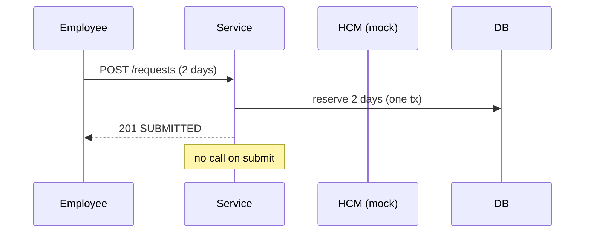
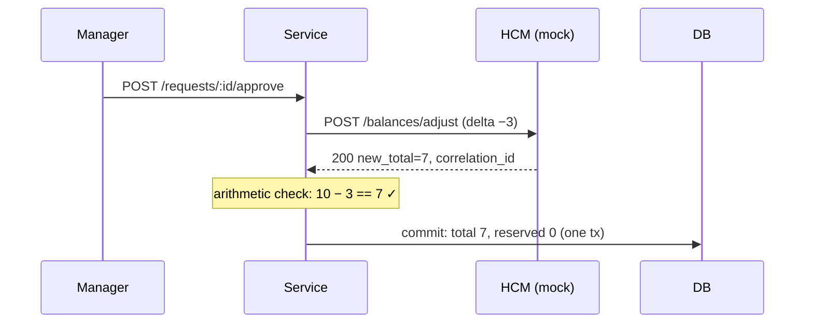
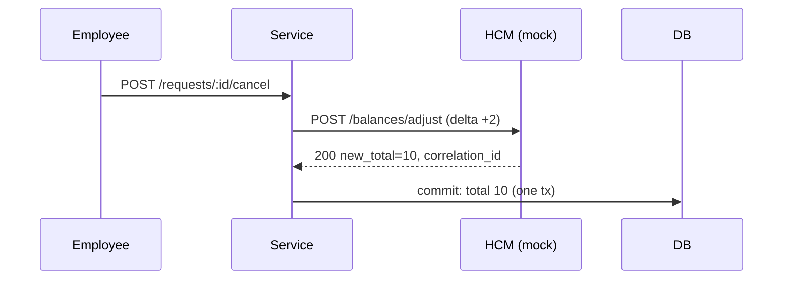
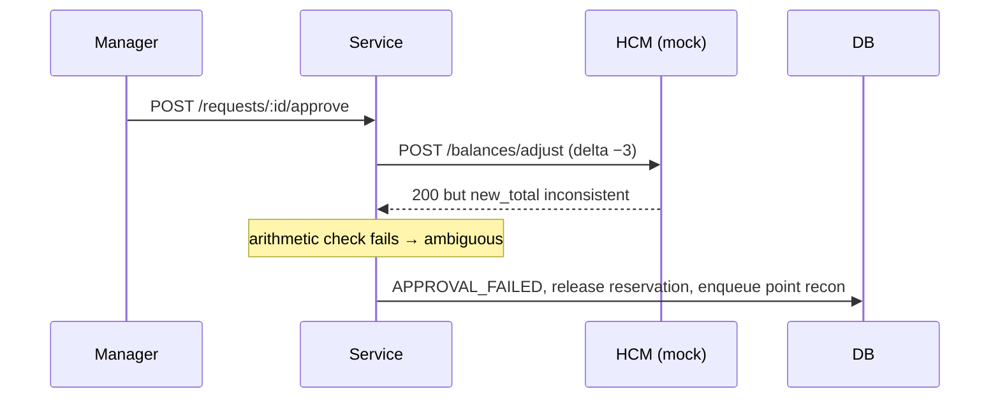
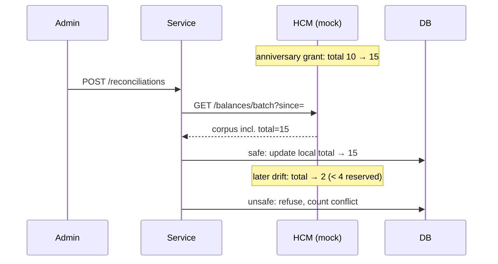
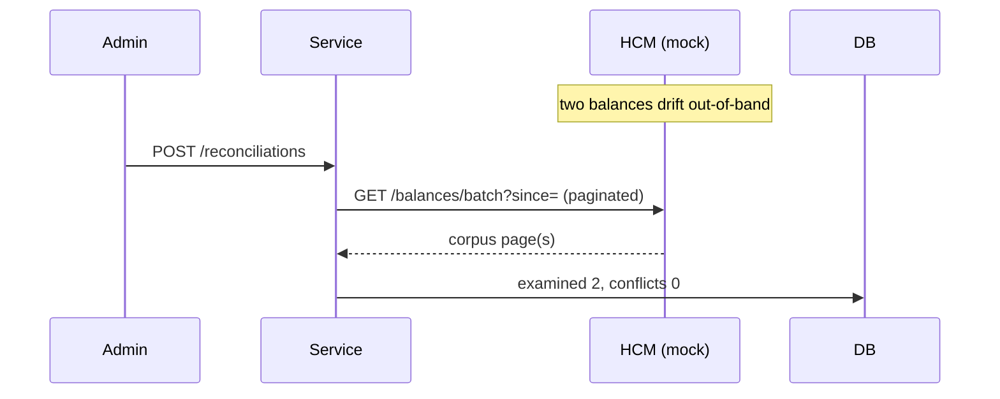
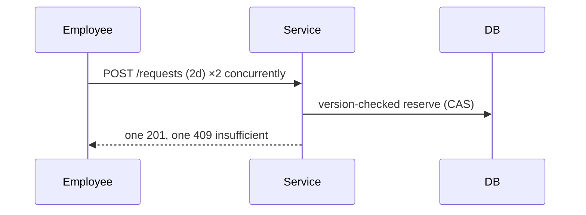
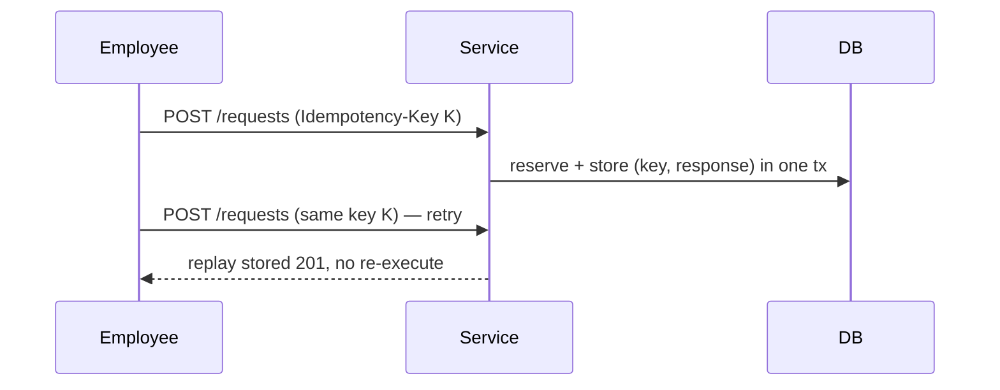

# System-Design Showcase

> **Generated by `npm run demo:scenarios`.** Do not edit by hand — it is regenerated from a live run of the service + mock HCM, and `npm run demo:check` fails CI if this file drifts from real behavior. Each section's sequence diagram is built from the actual calls made during the run.

This walkthrough boots the real time-off service and a mock HCM as separate processes, drives them over HTTP, and asserts every outcome. It centers the take-home's four challenges and ranges wider to show the system's design: the reservation model, both saga directions, HCM resilience, and consistency under concurrency and external change.

The four challenges from the brief:

1. **External writers** refresh HCM balances out-of-band (anniversary / year-start) → reconciliation.
2. **Realtime HCM API** for getting/sending single values → the saga's adjust call.
3. **Batch HCM endpoint** for the whole corpus → batch reconciliation.
4. **Unreliable HCM errors** — defended via the arithmetic check, circuit breaker, and stuck-state sweep.

See `docs/TRD.md` for the design narrative and `docs/trd/traceability.md` for the requirement→test map.

## Scenarios

**Lifecycle**

1. Instant reservation, no HCM round-trip
2. Approval saga with arithmetic-verified HCM commit (Challenge 2, Challenge 4)
3. Cancellation reverse saga (symmetry)

**Resilience**

4. Ambiguous HCM success is treated as failure (Challenge 4)

**Consistency**

5. External writer (anniversary grant) reconciled — safe vs unsafe (Challenge 1)
6. Batch corpus reconciliation (Challenge 3)
7. Concurrent submissions cannot oversell a balance
8. Idempotent retry returns the original, reserves once

---

### 1. Instant reservation, no HCM round-trip

_Lifecycle._ An employee submits a request. The service reserves the days locally and returns immediately — the employee gets instant feedback and the HCM is never touched on the submit path.

| Balance | total | reserved | available |
|---|---|---|---|
| before | 10 | 0 | 10 |
| after | 10 | 2 | 8 |

- Reads and submissions stay local — availability does not depend on the HCM.
- The reservation makes the balance instantly reflect in-flight requests.

---

### 2. Approval saga with arithmetic-verified HCM commit — `Challenge 2 · Challenge 4`

_Lifecycle._ A manager approves. The saga calls the realtime HCM adjust, then verifies the response arithmetically (new_total == pre_total − days) and that a correlation id is present before committing locally.

| Balance | total | reserved | available |
|---|---|---|---|
| before | 10 | 0 | 10 |
| after | 7 | 0 | 7 |

- Realtime HCM API (Challenge 2): the saga writes the single balance value.
- Defensive (Challenge 4): a 2xx is not trusted until the math and correlation id check out.

---

### 3. Cancellation reverse saga (symmetry)

_Lifecycle._ Cancelling a future-dated APPROVED request runs the reverse saga: an HCM increment restores the days, verified the same way as the forward saga. Total dips to 8 on approval, then returns to 10.

| Balance | total | reserved | available |
|---|---|---|---|
| before | 10 | 0 | 10 |
| after | 10 | 0 | 10 |

- The reverse saga mirrors the forward one — same arithmetic guarantee, opposite delta.
- Net effect over approve+cancel is balance-preserving.

---

### 4. Ambiguous HCM success is treated as failure — `Challenge 4`

_Resilience._ The HCM returns 200 but the new total does not match pre_total − days (an "it worked… or did it?" response). The arithmetic check catches it: the saga moves to APPROVAL_FAILED, releases the reservation, and enqueues a point reconciliation rather than trusting the 2xx.

| Balance | total | reserved | available |
|---|---|---|---|
| before | 10 | 0 | 10 |
| after | 10 | 0 | 10 |

- Challenge 4: a 2xx is never trusted blindly — the math must agree.
- Failure is safe: the reservation is released and the balance is left intact.

---

### 5. External writer (anniversary grant) reconciled — safe vs unsafe — `Challenge 1`

_Consistency._ The HCM total changes out-of-band (an anniversary grant). Reconciliation absorbs the safe increase (10→15). A later drift that would drop the total below the 4 reserved days is refused and counted as a conflict, protecting in-flight requests.

| Balance | total | reserved | available |
|---|---|---|---|
| before | 10 | 4 | 6 |
| after | 15 | 4 | 11 |

- Challenge 1: changes from other HCM writers are discovered by reconciliation, not webhooks.
- A reconciliation never corrupts a balance: if HCM < reserved, it conflicts instead of applying.

---

### 6. Batch corpus reconciliation — `Challenge 3`

_Consistency._ A single reconciliation run pulls the whole HCM corpus with a `since=` cursor and reconciles every balance, reporting how many it examined and how many conflicted.

- Challenge 3: the batch endpoint catches up on everything that changed since the last run.
- Each balance is reconciled under optimistic concurrency, safe against concurrent sagas.

---

### 7. Concurrent submissions cannot oversell a balance

_Consistency._ Two requests for 2 days race against a 3-day balance. Optimistic concurrency lets exactly one win; the other gets 409. The invariant available_days ≥ 0 holds — no overselling.

| Balance | total | reserved | available |
|---|---|---|---|
| before | 3 | 0 | 3 |
| after | 3 | 2 | 1 |

- Optimistic concurrency serializes contending writers per (employee, location).
- INV: total − reserved never goes negative, even under a race.

---

### 8. Idempotent retry returns the original, reserves once

_Consistency._ A client retries the same POST with the same Idempotency-Key (e.g. after a flaky network). The server replays the stored response without re-executing — the days are reserved exactly once.

| Balance | total | reserved | available |
|---|---|---|---|
| before | 10 | 0 | 10 |
| after | 10 | 2 | 8 |

- Client idempotency protects against double-submission on retries.
- The record shares the operation transaction, so replay can never diverge from the original.
